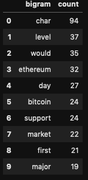

# Homework
## Onur Baser

We applied natural language processing to understand the sentiment in the latest news articles  featuring Bitcoin and Etherum. 

We used the [newsapi](https://newsapi.org/) to pull the latest news articles for Bitcoin and Ethereum and create a DataFrame of sentiment scores for each coin.

We found that Etherum has highest mean positive score. (0.0796)  In terms of highest negative score (.233) and highest positive score (,335) both coin had the same values. 
 
#### Natural Language Processing

In this section, we  used NLTK and Python to tokenize the text for each coin. 
For bitcoin:

and For Etherum 

Next, we look at the ngrams and word frequency for each coin. For Bitcoin, most frequent words were bitcoin, char an satoshi.

 and for  Etherum, the most frequent words were char, level, would and etherum. 
 

Finally, we generate word clouds for each coin to summarize the news for each coin.

#### Named Entity Recognition

In this section, we build a named entity recognition model for both coins and visualize the tags using SpaCy.

The list of entities for Bitcoing was as follows:

['bitcoin', 'bitcoin', 'bitcoin', 'bitcoin', 'bitcoin', 'bitcoin', 'bitcoin', 'bitcoin', 'bitcoin', 'bitcoin', 'bitcoin', 'bitcoin', 'bitcoin', 'bitcoin', 'bitcoin', 'bitcoin', 'bitcoin', 'bitcoin', 'bitcoin', 'bitcoin', 'bitcoin', 'canada', 'bitcoin', 'bitcoin', 'bitcoin', 'bitcoin', 'bitcoin', 'poland', 'bitcoin', 'bitcoin', 'bitcoin', 'bitcoin', 'bitcoin', 'bitcoin', 'blockchain', 'bitcoin', 'bitcoin', 'bitcoin', 'paris', 'france', 'bitcoin', 'new delhi', 'bitcoin', 'bitcoin', 'bitcoin', 'u char', 'blockchain', 'paris', 'france', 'bitcoin', 'blockchain', 'bitcoin', 'bitcoin']

For Etherum

The list of entities for Ethereum was as follows:

['bitcoin', 'ohio', 'bitcoin', 'bitcoin', 'bitcoin', 'bitcoin', 'blockchain', 'poland', 'new york city united', 'bitcoin', 'blockchain', 'new york', 'blockchain', 'blockchain', 'blockchain', 'blockchain', 'questio', 'blockchain']
- - -

 